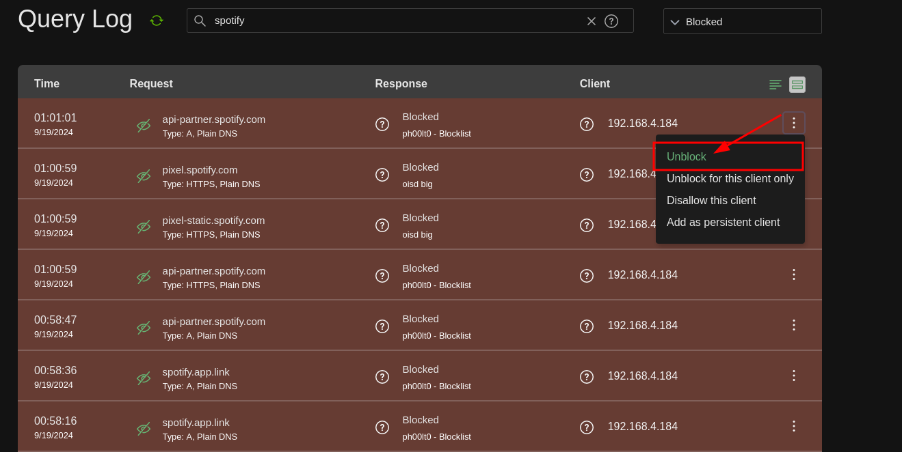

# SELinux

**Common Log Messages**

- You might see an error about how the source requested access to a file, and that was denied, thus triggering a policy violation.
- In this logging, the **scontext** is the **source context** while the **tcontext** is the **target context**.

---

**Making SELinux Analyzing Easier**

Download the **sealert** command:

```bash
dnf -y install setroubleshoot-server
```

Then restart your server.

You can grep for entries from sealert:

```bash
journalctl | grep sealert
```

From the info you get, you might see a command it recommends to run for further details:

```bash
sealert -l <SOME-ID>
```

Sometimes the logging will even recommend other commands to run in order to fix the issue. Take these commands with a grain of salt unless you know what you are doing. These recommendations will have a confidence score.

---

**Key Topics about SELinux**

- Newly created files inherit the context settings from the parent directory.
- Copied files do this as well.
- Original context settings are retained when using the `cp -a` command. To fix this, use `restorecon`.

---

# DNF

**Search for RPM's of a specific tool**

```bash
dnf whatprovides */semanage
dnf whatprovides
```

---

# AdGuard Home

**"X" Service is Blocked!**

1. Log onto your AdGuard home page and click on the **Blocked by Filters** button.

   

2. Then search for the domain you would like to block.

   

3. Select the side menu on the right-hand side and click **Unblock**.

   

And after that, you're done!

---

# Firewalld

**View All Available Services**

```bash
firewall-cmd --get-services
```

**Get Default Zone**

```bash
firewall-cmd --get-default-zone
```

**Get Available Zones**

```bash
firewall-cmd --get-zones
```

**List Services**

```bash
firewall-cmd --list-services
```

**List Services Enabled in Zone**

```bash
firewall-cmd --list-all --zone=public
```

**Add Port to Firewalld Permanently**

```bash
firewall-cmd --add-port=2020/tcp --permanent
```

**Add Service to Firewalld**

```bash
firewall-cmd --add-service=<service-name> --permanent
```

---

# Adblock via Pixelserv-TLS

**Setup Pixelserv-TLS**

1. Clone the repository from GitHub.

```bash
git clone https://github.com/kvic-z/pixelserv-tls.git
```

2. Install dependencies.

```bash
apt-get install libssl-dev zlib1g-dev
```

---

# Vim Config

**Show Hidden Files**

Add the following to your `~/.vimrc` or `~/.config/nvim/init.vim`:

```bash
set wildignore+=*/.git/*,*/tmp/*
set wildignore+=*/node_modules/*
```

---

# Markdown

**Markdown Table Template**

```
| Left Align (default) | Center Align | Right Align |
| :------------------- | :----------: | ----------: |
| React.js             | Node.js      | MySQL       |
| Next.js              | Express      | MongoDB     |
| Vue.js               | Nest.js      | Redis       |
```

---

# Youtube Downloading

**Download Only the Transcript**

```bash
yt-dlp --verbose --skip-download --write-subs --write-auto-subs --sub-lang en --sub-format ttml --convert-subs srt --output "transcript.%(ext)s" <PUT-URL-HERE> && sed -i '' -e '/^[0-9][0-9]:[0-9][0-9]:[0-9][0-9].[0-9][0-9][0-9] --> [0-9][0-9]:[0-9][0-9]:[0-9][0-9].[0-9][0-9][0-9]$/d' -e '/^[[:digit:]]{1,3}$/d' -e 's/<[^>]*>//g' ./transcript.en.srt && sed -e 's/<[^>]*>//g' -e '/^[[:space:]]*$/d' transcript.en.srt > output.txt && rm transcript.en.srt
```

---

# FHS

This section is dedicated to my notes around the Filesystem Hierarchy Standard (FHS) that's used widely among most Linux distributions. These may contain pure info or snippets that may help with configuring a system and knowing where to allocate certain files. Each section is divided by directory names.

## /home

### Home Notes

- Any scripts located in `/home/<user>/bin` will be automatically added to the user's PATH.
- You may configure an NFS share to store and serve the home directory for users on your local network.

Example:

```bash
# set PATH so it includes user's private bin if it exists
if [ -d "$HOME/bin" ] ; then
    PATH="$HOME/bin:$PATH"
fi
```
